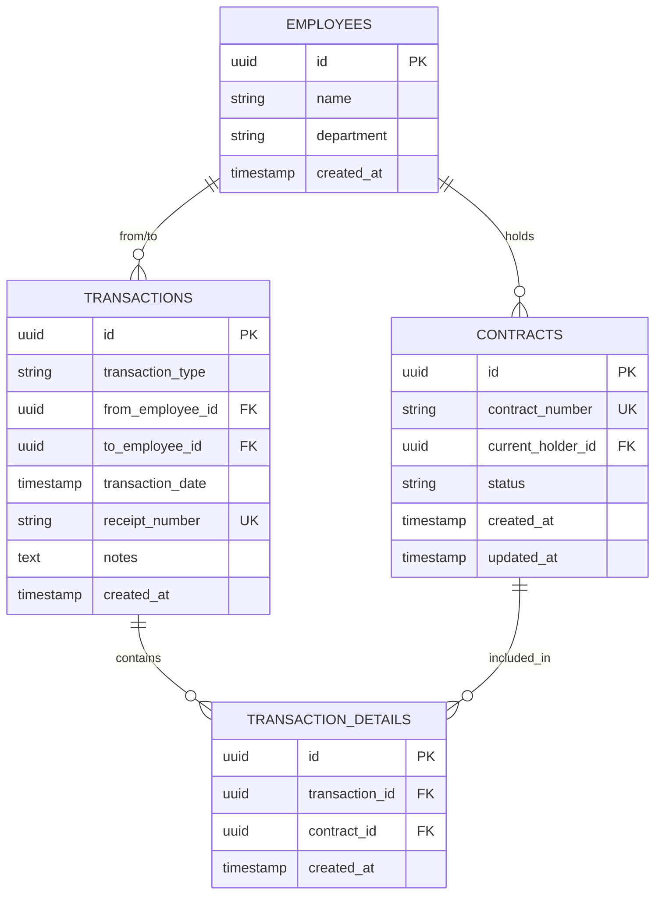

# 📋 نظام استلام وتسليم الوثائق · Document Transfer Management System

<div align="center">
  


</div>

> **AR/EN**: هذا المستودع يقدّم نظاماً بسيطاً لإدارة حركة استلام وتسليم الوثائق/العقود بين موظفي المكتب والأرشيف، مع تتبّع تفصيلي لكل عقد وطباعة إيصالات رسمية.  
> This repo provides a simple system to manage document/contract transfers between office and archive staff, with detailed tracking for each contract and printable official receipts.

---

## 🧭 الفهرس · Table of Contents
- [نظرة عامة · Overview](#-نظرة-عامة--overview)
- [المميزات · Features](#-المميزات--features)
- [الصور · Screenshots](#-الصور--screenshots)
- [البدء السريع · Quick Start](#-البدء-السريع--quick-start)
- [البنية التقنية · Architecture](#-البنية-التقنية--architecture)
- [مخطط قاعدة البيانات · Database Schema](#-مخطط-قاعدة-البيانات--database-schema)
- [دليل الاستخدام · User Guide](#-دليل-الاستخدام--user-guide)
- [الأمان · Security](#-الأمان--security)
- [التقنيات المستخدمة · Tech Stack](#-التقنيات-المستخدمة--tech-stack)
- [خطة التطوير · Roadmap](#-خطة-التطوير--roadmap)
- [المساهمة · Contributing](#-المساهمة--contributing)
- [الترخيص · License](#-الترخيص--license)
- [الدعم والتواصل · Support](#-الدعم-والتواصل--support)
- [صنع في الأردن · Made in Jordan](#-صنع-في-الأردن--made-in-jordan)

---

## 📖 نظرة عامة · Overview
**AR:** نظام متكامل لإدارة حركة استلام وتسليم الوثائق والعقود بين الموظفين في المكتب والأرشيف. يوفّر تتبّعاً دقيقاً لحركة كل عقد مع إمكانية طباعة إيصالات رسمية موقّعة. التنسيق الافتراضي للتواريخ في الواجهة: `DD/MM/YYYY - hh:mm AM/PM` (مثال: `17/08/2025 - 02:30 PM`).  
**EN:** A comprehensive system for managing document and contract transfers between office staff and archive employees. It provides accurate tracking of each contract’s movement with the ability to print official signed receipts. Default date display format is `DD/MM/YYYY - hh:mm AM/PM`.

---

## ✨ المميزات · Features

### 🔄 إدارة الحركات · Transaction Management
- ✅ تسجيل عمليات **الاستلام/التسليم**
- ✅ إدخال **عدة عقود** في حركة واحدة
- ✅ إضافة **ملاحظات** لكل حركة
- ✅ توليد **رقم إيصال فريد** تلقائياً

### 🔍 البحث والاستعلام · Search & Query
- ✅ **بحث فوري** عن أي عقد
- ✅ معرفة **الموظف الحالي المسؤول** عن العقد
- ✅ عرض **تاريخ آخر حركة**
- ✅ عرض **جميع العقود المسجلة**

### 📊 التقارير والإحصائيات · Reports & Statistics
- ✅ إحصائيات فورية (إجمالي العقود، الحركات، حركات اليوم)
- ✅ تقارير مفصلة حسب **الفترة الزمنية**
- ✅ **فلترة** (يومي / أسبوعي / شهري)

### 🖨️ طباعة الإيصالات · Receipt Printing
- ✅ إيصال رسمي لكل عملية
- ✅ مكان مخصص **لتوقيع الطرفين**
- ✅ **قابلية الطباعة** المباشرة
- ✅ حفظ **نسخة إلكترونية**

### 📱 واجهة المستخدم · User Interface
- ✅ تصميم عصري ومتجاوب
- ✅ **واجهة عربية بالكامل**
- ✅ سهولة الاستخدام

---

## 🖼️ الصور · Screenshots
> Place screenshots in `./screenshots/` and update the links below.

| |
|---|
|  |
|  |
|  |
|  |
|  |

---

## 🚀 البدء السريع · Quick Start

### المتطلبات · Prerequisites
- متصفح حديث: Chrome / Firefox / Edge / Safari  
- حساب على **Supabase**
- اتصال إنترنت

### 1) إعداد قاعدة البيانات · Database Setup (Supabase / PostgreSQL)

> **ملاحظة / Note:** في Supabase يُفضّل استخدام `gen_random_uuid()` بدل `uuid_generate_v4()`.  
> Prefer `gen_random_uuid()` on Supabase instead of `uuid_generate_v4()`.

```sql
-- Enable pgcrypto for gen_random_uuid (usually enabled by default on Supabase)
-- CREATE EXTENSION IF NOT EXISTS pgcrypto;

-- 1) الموظفون · Employees
CREATE TABLE IF NOT EXISTS employees (
  id UUID PRIMARY KEY DEFAULT gen_random_uuid(),
  name VARCHAR(255) NOT NULL,
  department VARCHAR(50) NOT NULL CHECK (department IN ('مكتب', 'أرشيف')),
  created_at TIMESTAMPTZ DEFAULT NOW()
);

-- 2) العقود · Contracts
CREATE TABLE IF NOT EXISTS contracts (
  id UUID PRIMARY KEY DEFAULT gen_random_uuid(),
  contract_number VARCHAR(100) UNIQUE NOT NULL,
  current_holder_id UUID REFERENCES employees(id),
  status VARCHAR(50) DEFAULT 'متاح',
  created_at TIMESTAMPTZ DEFAULT NOW(),
  updated_at TIMESTAMPTZ DEFAULT NOW()
);

-- 3) الحركات · Transactions
CREATE TABLE IF NOT EXISTS transactions (
  id UUID PRIMARY KEY DEFAULT gen_random_uuid(),
  transaction_type VARCHAR(20) NOT NULL CHECK (transaction_type IN ('استلام', 'تسليم')),
  from_employee_id UUID REFERENCES employees(id),
  to_employee_id UUID REFERENCES employees(id),
  transaction_date TIMESTAMPTZ DEFAULT NOW(),
  receipt_number VARCHAR(100) UNIQUE,
  notes TEXT,
  created_at TIMESTAMPTZ DEFAULT NOW()
);

-- 4) تفاصيل الحركات · Transaction Details
CREATE TABLE IF NOT EXISTS transaction_details (
  id UUID PRIMARY KEY DEFAULT gen_random_uuid(),
  transaction_id UUID REFERENCES transactions(id) ON DELETE CASCADE,
  contract_id UUID REFERENCES contracts(id),
  created_at TIMESTAMPTZ DEFAULT NOW()
);
```

### 2) إضافة بيانات الموظفين · Seed Employees
```sql
INSERT INTO employees (name, department) VALUES
  ('ربى الشريف', 'مكتب'),
  ('صفاء ابو قديري', 'مكتب'),
  ('مؤمن قازان', 'أرشيف'),
  ('حسان قازان', 'أرشيف'),
  ('عمار قازان', 'أرشيف');
```

### 3) تهيئة الواجهة · Front-End Config
في ملف `index.html` (أو ملف JS)، حدّث مفاتيح Supabase:

```javascript
// Replace with your own project settings
const SUPABASE_URL = 'YOUR_SUPABASE_PROJECT_URL';
const SUPABASE_ANON_KEY = 'YOUR_SUPABASE_ANON_KEY';

// Optional: unified date formatting (UI only)
function formatDate(dateInput) {
  const d = (dateInput instanceof Date) ? dateInput : new Date(dateInput);
  if (isNaN(d.getTime())) return '-';
  const pad2 = (n) => String(n).padStart(2, '0');
  let h = d.getHours();
  const ampm = h >= 12 ? 'PM' : 'AM';
  h = h % 12 || 12;
  return `${pad2(d.getDate())}/${pad2(d.getMonth() + 1)}/${d.getFullYear()} - ${pad2(h)}:${pad2(d.getMinutes())} ${ampm}`;
}
```

### 4) التشغيل · Run
- افتح الملف `index.html` مباشرة في المتصفح، أو استخدم خادم بسيط (مثل `npx serve`).
- ابدأ بإضافة موظفين/عقود ثم سجّل أول حركة، وسيظهر لك الإيصال للطباعة.

---

## 🏗️ البنية التقنية · Architecture

```
UI (HTML/CSS/JS)
        │
        ▼
Supabase JS Client
        │
        ▼
┌───────────────────────────────┐
│          Supabase             │
│  ┌─────────────────────────┐  │
│  │   PostgreSQL Database   │  │
│  └─────────────────────────┘  │
│  ┌─────────────────────────┐  │
│  │    Realtime Engine      │  │
│  └─────────────────────────┘  │
│  ┌─────────────────────────┐  │
│  │     Authentication      │  │
│  └─────────────────────────┘  │
└───────────────────────────────┘
```

---

## 📊 مخطط قاعدة البيانات · Database Schema



---

## 📚 دليل الاستخدام · User Guide

### 🔄 تسجيل حركة جديدة
1. اختر نوع العملية: **استلام** أو **تسليم**  
2. حدّد الموظف **المسلِّم** و**المستلم**  
3. أدخل **أرقام العقود** (سطر لكل رقم)  
4. أضف **ملاحظات** إن وجدت  
5. اضغط **حفظ وطباعة الإيصال**

### 🔍 البحث عن عقد
- اذهب إلى تبويب **البحث والاستعلام**  
- أدخل **رقم العقد** واضغط Enter أو زر البحث  
- ستظهر **تفاصيل العقد** والحركة الأخيرة والمسؤول الحالي

### 📊 عرض التقارير
- اذهب إلى **التقارير**  
- اختر **الفترة الزمنية** (يومي/أسبوعي/شهري)  
- اطّلع على **الإحصائيات** والتفاصيل

### 🖨️ طباعة إيصال
- بعد حفظ الحركة يظهر **الإيصال** تلقائيًا  
- اضغط **طباعة**، ووقّع من كلا الطرفين  
- احفظ **نسخة إلكترونية** إن رغبت

---

## 🔐 الأمان · Security
- ✅ استخدام مفاتيح API بشكل آمن (لا تنشر مفاتيح حسّاسة في مستودع عام)
- ✅ التحقق من صحة الإدخال في الواجهة
- ✅ حماية ضد **SQL Injection** (استخدم Supabase SDK/Policies)
- ✅ تشفير الاتصال عبر **HTTPS**
- ✅ يمكن إضافة **نظام تسجيل دخول** وصلاحيات

> **Supabase Policies (Row Level Security):** يوصى بتفعيل RLS وكتابة سياسات للقراءة/الكتابة حسب الأدوار.

---

## 🛠️ التقنيات المستخدمة · Tech Stack

| التقنية | الإصدار | الوصف |
|---|---:|---|
| HTML5 | 5 | هيكل الصفحة |
| CSS3 | 3 | التصميم والتنسيق |
| JavaScript | ES6+ | المنطق والتفاعل |
| Supabase | 2.x | قاعدة البيانات والـ Backend |
| PostgreSQL | 15+ | نظام إدارة قاعدة البيانات |

---

## 📈 خطة التطوير · Roadmap
- [ ] نظام تسجيل دخول متعدد المستخدمين
- [ ] صلاحيات متفاوتة للمستخدمين (Roles/Policies)
- [ ] تصدير التقارير إلى **Excel/PDF**
- [ ] نظام تنبيهات وإشعارات
- [ ] لوحة تحكّم للمدير
- [ ] تطبيق موبايل (PWA/Capacitor)
- [ ] نظام **باركود** للعقود
- [ ] نسخ احتياطي تلقائي
- [ ] تكامل مع أنظمة أخرى

---

## 🤝 المساهمة · Contributing
نرحب بالمساهمات!

1. **Fork** للمشروع  
2. إنشاء فرع: `git checkout -b feature/AmazingFeature`  
3. تنفيذ التعديلات: `git commit -m "Add AmazingFeature"`  
4. رفع الفرع: `git push origin feature/AmazingFeature`  
5. افتح **Pull Request**

---

## 📝 الترخيص · License
هذا المشروع تحت رخصة **MIT**. راجع ملف `LICENSE` للمزيد.

---

## 📞 الدعم والتواصل · Support
- 📧 البريد الإلكتروني: `your-email@example.com`  
- 🐛 الإبلاغ عن الأخطاء: افتح **Issue** في GitHub

---

## ❤️ صنع في الأردن · Made in Jordan
<div align="center">
  صُنع بـ ❤️ في الأردن · Made with ❤️ in Jordan
</div>
